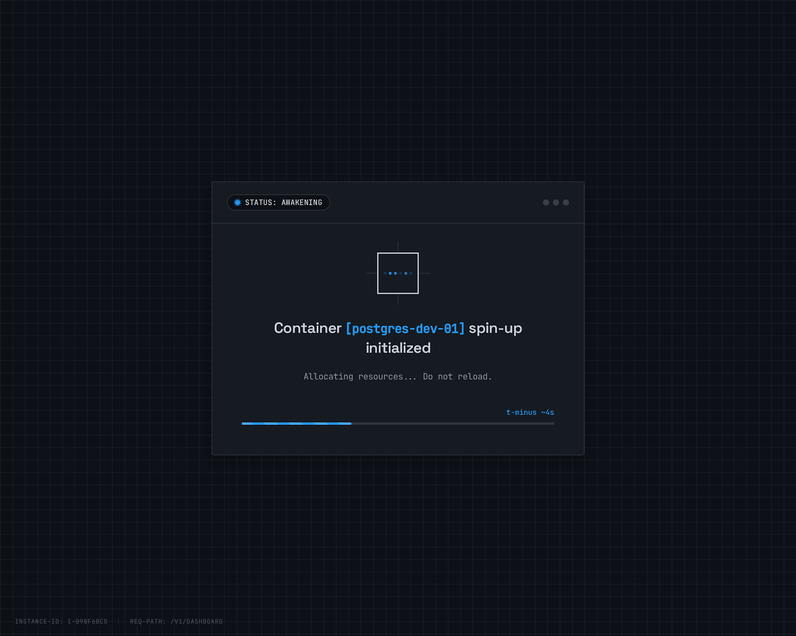
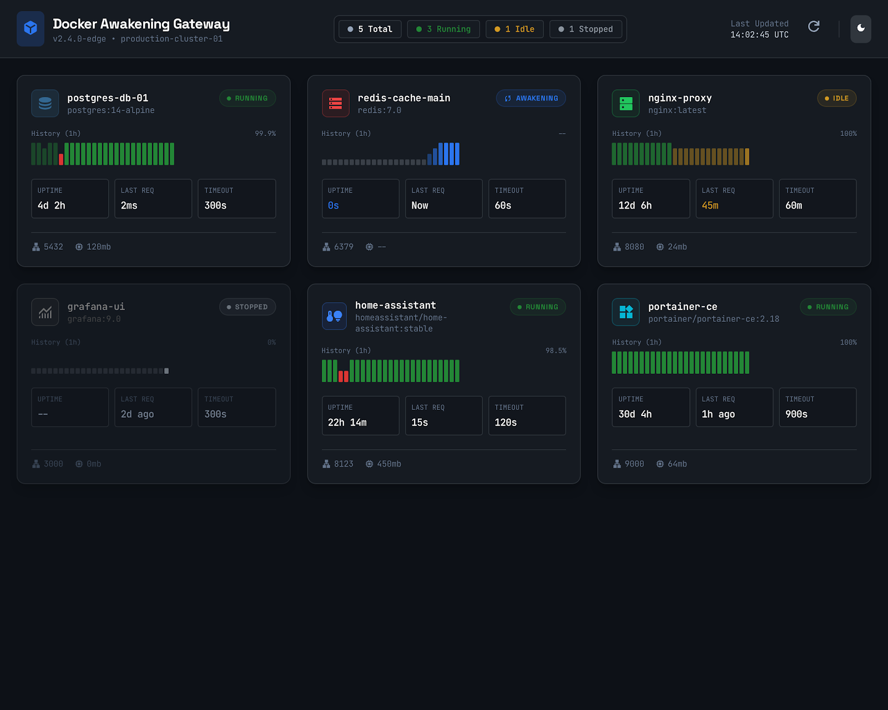

# Docker Awakening Gateway

<p align="center">
  <a href="https://github.com/ares-17/docker-gateway/actions/workflows/ci.yml">
    
  </a>
  <a href="https://github.com/ares-17/docker-gateway/releases">
    
  </a>
  <a href="https://github.com/ares-17/docker-gateway/pkgs/container/docker-gateway">
    
  </a>
  <a href="https://github.com/ares-17/docker-gateway/blob/main/LICENSE">
    
  </a>
  
</p>

<p align="center">
  
</p>

An ultra-lightweight reverse proxy that **wakes up stopped Docker containers on demand**. When a request arrives for a sleeping container, the gateway shows an animated loading page with live logs, starts the container, and transparently proxies once it's ready.

Built as a single static Go binary — ideal for home labs, edge devices, and resource-constrained environments. Final image: **~22 MB** (distroless).

<p align="center">
  <a href="https://ares-17.github.io/docker-awakening-gateway/">
    
  </a>
</p>

---

<table>
<tr>
<td width="50%">

<p align="center"><sub>Live loading page with real-time container logs</sub></p>
</td>
<td width="50%">

<p align="center"><sub><code>/_status</code> dashboard — live heartbeat, uptime, idle timeouts</sub></p>
</td>
</tr>
</table>

## Features

- **On-demand startup** — containers sleep when idle and wake automatically on the first request
- **Live loading page** — animated UI with real-time logs while the container boots
- **Idle auto-stop** — configurable `idle_timeout` per container; background watcher stops idle containers
- **Cron scheduling** — `schedule_start` / `schedule_stop` per container; requests outside the window get a styled offline page
- **Dependency ordering** — `depends_on` with topological sort, starts `postgres` before `app` automatically
- **Load balancing** — round-robin across container groups behind a single hostname
- **Label discovery** — add `dag.enabled=true` to any container; no static config needed
- **Hot-reload** — `docker kill -s HUP` reloads `config.yaml` without dropping connections
- **Prometheus metrics** — per-container counters at `/_metrics`; optional Basic Auth or Bearer Token on admin endpoints

## Quick Start

Add labels to any container to register it with the gateway:

```yaml
services:
  gateway:
    image: ghcr.io/ares-17/docker-gateway:latest
    ports:
      - "8080:8080"
    volumes:
      - /var/run/docker.sock:/var/run/docker.sock:ro

  my-app:
    image: my-app:latest
    labels:
      - "dag.enabled=true"
      - "dag.host=my-app.localhost"
      - "dag.target_port=3000"
      - "dag.idle_timeout=30m"
```

Point `my-app.localhost` at the gateway and visit it in your browser — the gateway takes care of the rest.

For static config (`config.yaml`), dependency ordering, scheduling, auth, and more, see the **[full documentation →](https://ares-17.github.io/docker-awakening-gateway/)**.

## License

MIT
