# Docker Awakening Gateway

An ultra-lightweight reverse proxy that **wakes up stopped Docker containers on demand**. When a request arrives for a sleeping container, the gateway shows an animated loading page with live logs, starts the container, and transparently proxies once it's ready.

Built as a single static Go binary — ideal for home labs, edge devices, and resource-constrained environments. Final image: **~22 MB** (distroless).

[**📖 Read the documentation »**](https://ares-17.github.io/docker-aweking-gateway/)

---

<table>
<tr>
<td width="50%">

<p align="center"><sub>Loading page with live log stream while the container boots</sub></p>
</td>
<td width="50%">

<p align="center"><sub><code>/_status</code> admin dashboard — live heartbeat, uptime, idle timeouts</sub></p>
</td>
</tr>
</table>

---

## How it works

### Request routing

```mermaid
---
config:
  theme: neutral
  flowchart:
    curve: basis
---
flowchart TD
    A([HTTP Request\nHost: my-app.example.com]) --> B

    B{Host lookup\nO&lpar;1&rpar;}
    B -->|No match| C[404 Not Found]
    B -->|Group host| D[Round-robin pick\nmember container]
    B -->|Container host| E{Container\nrunning?}

    D --> E

    E -->|Yes| F{Dependencies\nall running?}
    F -->|Yes| G[RecordActivity]
    G --> H[Reverse Proxy\nHTTP · WebSocket]
    H --> Z([✅ Response])

    F -->|No| I
    E -->|No| I[Serve loading page\nlive log stream]

    I --> J[async: docker start\nreadiness probe\nTCP · HTTP /healthz]
    J --> K[Browser polls /_health\nevery 2 s]
    K --> L([✅ Redirect to redirect_path])

    style C fill:#c0392b,color:#fff
    style Z fill:#27ae60,color:#fff
    style L fill:#27ae60,color:#fff
    style I fill:#2980b9,color:#fff
    style J fill:#2980b9,color:#fff
```



### Awakening sequence


### Background processes

```mermaid
flowchart LR
    subgraph discovery ["🔍 Auto-Discovery  (every 15 s)"]
        direction LR
        DA[Docker daemon\nlabels] -->|dag.enabled=true| DB[DAG polls]
        DB -->|merge| DC[Host index]
        DC -->|static wins\non conflict| DC
    end

    subgraph idle ["😴 Idle Watcher  (every 60 s)"]
        direction LR
        IA{last request\n> idle_timeout?} -->|Yes| IB[docker stop]
        IA -->|No| IC[skip]
        IB --> ID[next request\n→ restart]
    end

    subgraph reload ["🔄 Hot-Reload  (SIGHUP)"]
        direction LR
        RA[docker kill -s HUP] --> RB[re-read config.yaml]
        RB --> RC[immediate\ndiscovery pass]
        RC --> RD[host index\nupdated]
    end
```



---

## Configuration

The gateway can be configured in two complementary ways — use either or both:

### Option A — Docker labels (auto-discovery)

Add labels directly to any container. The gateway discovers them automatically:

```yaml
services:
  my-app:
    image: my-app:latest
    container_name: my-app
    labels:
      - "dag.enabled=true"
      - "dag.host=my-app.localhost"
      - "dag.target_port=3000"
      - "dag.start_timeout=90s"
      - "dag.idle_timeout=30m"
      - "dag.health_path=/healthz"
      - "dag.icon=nodedotjs"
```

### Option B — `config.yaml` (static, hot-reloadable)

Mount a YAML file for centralized routing and global settings:

```yaml
gateway:
  port: "8080"
  log_lines: 30
  discovery_interval: "15s"
  trusted_proxies:
    - "10.0.0.0/8"
    - "172.16.0.0/12"

containers:
  - name: "my-app"
    host: "my-app.localhost"
    target_port: "3000"
    start_timeout: "90s"
    idle_timeout: "30m"
    health_path: "/healthz"
    redirect_path: "/dashboard"
    depends_on: ["postgres"]

groups:
  - name: "api-cluster"
    host: "api.localhost"
    strategy: "round-robin"
    containers: ["api-1", "api-2", "api-3"]
```

**Hot-reload** — edit `config.yaml` and apply without restarting:
```bash
docker kill -s HUP docker-gateway
```

### All container options

| Label / YAML key | Default | Description |
|------------------|---------|-------------|
| `dag.enabled` / — | — | **Required.** Enable auto-discovery for this container |
| `dag.host` / `host` | — | **Required.** `Host` header to match (e.g. `app.example.com`) |
| `dag.target_port` / `target_port` | `80` | Port the container listens on |
| `dag.start_timeout` / `start_timeout` | `60s` | Max time to wait for boot before showing error page |
| `dag.idle_timeout` / `idle_timeout` | `0` (off) | Inactivity period before auto-stop (e.g. `15m`, `2h`) |
| `dag.network` / `network` | `""` | Docker network to resolve the container IP from |
| `dag.redirect_path` / `redirect_path` | `/` | URL path to redirect to after successful boot |
| `dag.health_path` / `health_path` | `""` | HTTP path for readiness probe (`GET` → expects 2xx); empty = TCP dial |
| `dag.depends_on` / `depends_on` | `[]` | Comma-separated containers that must be running first |
| `dag.icon` / `icon` | `docker` | [Simple Icons](https://simpleicons.org/) slug for the `/_status` dashboard |

### Environment variables

| Variable | Description |
|----------|-------------|
| `CONFIG_PATH` | Override path to `config.yaml` (default: `/etc/gateway/config.yaml`) |
| `DISCOVERY_INTERVAL` | Override label polling interval (e.g. `5s`, `60s`) |
| `ADMIN_AUTH_METHOD` | `none`, `basic`, or `bearer` |
| `ADMIN_AUTH_USERNAME` | Username (required for `basic`) |
| `ADMIN_AUTH_PASSWORD` | Password (required for `basic`) |
| `ADMIN_AUTH_TOKEN` | Token (required for `bearer`) |

---

## Admin Authentication

Protect `/_status`, `/_status/api`, `/_status/wake`, and `/_metrics` with optional auth. Disabled by default.

**Basic Auth** (browser login dialog):
```yaml
# config.yaml
gateway:
  admin_auth:
    method: "basic"
    username: "admin"
    password: "s3cret"
```

**Bearer Token** (Prometheus / automation):
```yaml
gateway:
  admin_auth:
    method: "bearer"
    token: "my-secret-token"
```

Or via environment variables (higher priority):
```yaml
environment:
  - ADMIN_AUTH_METHOD=bearer
  - ADMIN_AUTH_TOKEN=my-secret-token
```

> [!WARNING]
> Both methods transmit credentials in cleartext over HTTP. Always place a TLS-terminating
> proxy (Nginx, Caddy, Traefik) in front of the gateway in production.

---

## Prometheus Metrics

The gateway exposes a standard Prometheus endpoint at `/_metrics` (same port as the gateway).

```yaml
# prometheus.yml
scrape_configs:
  - job_name: "docker-gateway"
    scrape_interval: 15s
    static_configs:
      - targets: ["gateway:8080"]
    metrics_path: "/_metrics"
    # If Bearer Token auth is enabled:
    # bearer_token: "my-secret-token"
```

| Metric | Type | Description |
|--------|------|-------------|
| `gateway_requests_total` | Counter | Proxied HTTP requests, labelled by `container` and `status_code` |
| `gateway_request_duration_seconds` | Histogram | Full request latency including proxy time |
| `gateway_starts_total` | Counter | Container wake attempts, labelled by `container` and `result` (`success`/`error`) |
| `gateway_start_duration_seconds` | Histogram | Time from `docker start` to readiness probe passing |
| `gateway_idle_stops_total` | Counter | Containers stopped by the idle watcher |

---

## License

MIT
